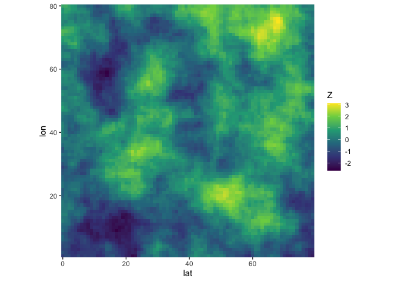

<!-- README.md is generated from README.Rmd. Please edit that file -->

# stdmatern

This directory is for development of fast and memory-efficient code that
creates Matérn precision matrices that have been standardized so that
their inverse is a correlation matrix. The code is written in C++ and
made available inside R with the `{Rcpp}` packages.

The package can be installed with

``` r
pak::pak("bgautijonsson/stdmatern")
```

``` r
library(stdmatern)
#> Loading required package: Matrix
```

``` r
Q <- make_standardized_matern(dim = 3, rho = 0.5, nu = 0)
```

``` r
Q
#> 9 x 9 sparse Matrix of class "dgCMatrix"
#>                                                                                
#>  [1,]  1.155093 -0.2808520  .        -0.2808520  .          .          .       
#>  [2,] -0.280852  1.2291667 -0.280852  .         -0.2661131  .          .       
#>  [3,]  .        -0.2808520  1.155093  .          .         -0.2808520  .       
#>  [4,] -0.280852  .          .         1.2291667 -0.2661131  .         -0.280852
#>  [5,]  .        -0.2661131  .        -0.2661131  1.2962963 -0.2661131  .       
#>  [6,]  .         .         -0.280852  .         -0.2661131  1.2291667  .       
#>  [7,]  .         .          .        -0.2808520  .          .          1.155093
#>  [8,]  .         .          .         .         -0.2661131  .         -0.280852
#>  [9,]  .         .          .         .          .         -0.2808520  .       
#>                           
#>  [1,]  .          .       
#>  [2,]  .          .       
#>  [3,]  .          .       
#>  [4,]  .          .       
#>  [5,] -0.2661131  .       
#>  [6,]  .         -0.280852
#>  [7,] -0.2808520  .       
#>  [8,]  1.2291667 -0.280852
#>  [9,] -0.2808520  1.155093
```

``` r
Q |> solve()
#> 9 x 9 sparse Matrix of class "dgCMatrix"
#>                                                                       
#>  [1,] 1.00000000 0.27611088 0.08016032 0.27611088 0.1353601 0.05357375
#>  [2,] 0.27611088 1.00000000 0.27611088 0.13559322 0.2783556 0.13559322
#>  [3,] 0.08016032 0.27611088 1.00000000 0.05357375 0.1353601 0.27611088
#>  [4,] 0.27611088 0.13559322 0.05357375 1.00000000 0.2783556 0.08474576
#>  [5,] 0.13536011 0.27835560 0.13536011 0.27835560 1.0000000 0.27835560
#>  [6,] 0.05357375 0.13559322 0.27611088 0.08474576 0.2783556 1.00000000
#>  [7,] 0.08016032 0.05357375 0.02605210 0.27611088 0.1353601 0.05357375
#>  [8,] 0.05357375 0.08474576 0.05357375 0.13559322 0.2783556 0.13559322
#>  [9,] 0.02605210 0.05357375 0.08016032 0.05357375 0.1353601 0.27611088
#>                                       
#>  [1,] 0.08016032 0.05357375 0.02605210
#>  [2,] 0.05357375 0.08474576 0.05357375
#>  [3,] 0.02605210 0.05357375 0.08016032
#>  [4,] 0.27611088 0.13559322 0.05357375
#>  [5,] 0.13536011 0.27835560 0.13536011
#>  [6,] 0.05357375 0.13559322 0.27611088
#>  [7,] 1.00000000 0.27611088 0.08016032
#>  [8,] 0.27611088 1.00000000 0.27611088
#>  [9,] 0.08016032 0.27611088 1.00000000
```

Creating and standardizing a 1600x1600 precision matrix

``` r
bench::mark(
  make_standardized_matern(dim = 40, rho = 0.5, nu = 0)
)
#> # A tibble: 1 × 6
#>   expression                             min median `itr/sec` mem_alloc `gc/sec`
#>   <bch:expr>                           <bch> <bch:>     <dbl> <bch:byt>    <dbl>
#> 1 make_standardized_matern(dim = 40, … 1.3ms 1.34ms      708.    98.3KB        0
```

# Sampling spatial data

Here we sample highly dependent spatial data on a 100x100 grid,
i.e. there’s 10.000 observational locations.

``` r
start <- tictoc::tic()
grid_dim <- 100
rho <- 0.9
nu <- 2
Z <- sample_standardized_matern(grid_dim, rho, nu, 1)

tibble(
  Z = as.numeric(Z)
) |> 
  mutate(
    id = row_number(),
    lat = (id - 1) %% grid_dim,
    lon = cumsum(lat == 0),
  ) |> 
  ggplot(aes(lat, lon, fill = Z)) +
  geom_raster() +
  scale_fill_viridis_c() +
  coord_fixed(expand = FALSE)
```



``` r
stop <- tictoc::toc()
#> 0.223 sec elapsed
```

# Normal density

The package also implements a method for calculating the log-density of
a multivariate normal with appropriate precision matrix. The function
avoids creating the precision matrix Q by using known results about
kroncker sums and eigendecompositions. This causes the density
evaluation to be blazingly fast, even for very large spatial fields.

``` r
library(purrr)
library(glue)
library(gt)

my_fun <- function(dim) {
  x <- sample_standardized_matern(dim, 0.5, 0, 1)
  bench::mark(
    matern_mvn_density(x, dim, 0.5, 0),
    filter_gc = FALSE,
    iterations = 10,
    check = FALSE
  ) |> 
    mutate(
      dim = dim
    )
}

results <- map(c(10, 20, 30, 40, 50, 60, 70, 80, 90, 100, 200), my_fun)

results |> 
  list_rbind() |> 
  select(Q_size = dim,time = median, memory = mem_alloc) |> 
  mutate(
    Field_size = glue("{Q_size^2} locations"),
    Q_size = glue("{Q_size^2}x{Q_size^2}")
  ) |> 
  select(Field_size, Q_size, time) |> 
  gt()
```

<div id="fpmbtytepi" style="padding-left:0px;padding-right:0px;padding-top:10px;padding-bottom:10px;overflow-x:auto;overflow-y:auto;width:auto;height:auto;">
<style>#fpmbtytepi table {
  font-family: system-ui, 'Segoe UI', Roboto, Helvetica, Arial, sans-serif, 'Apple Color Emoji', 'Segoe UI Emoji', 'Segoe UI Symbol', 'Noto Color Emoji';
  -webkit-font-smoothing: antialiased;
  -moz-osx-font-smoothing: grayscale;
}
&#10;#fpmbtytepi thead, #fpmbtytepi tbody, #fpmbtytepi tfoot, #fpmbtytepi tr, #fpmbtytepi td, #fpmbtytepi th {
  border-style: none;
}
&#10;#fpmbtytepi p {
  margin: 0;
  padding: 0;
}
&#10;#fpmbtytepi .gt_table {
  display: table;
  border-collapse: collapse;
  line-height: normal;
  margin-left: auto;
  margin-right: auto;
  color: #333333;
  font-size: 16px;
  font-weight: normal;
  font-style: normal;
  background-color: #FFFFFF;
  width: auto;
  border-top-style: solid;
  border-top-width: 2px;
  border-top-color: #A8A8A8;
  border-right-style: none;
  border-right-width: 2px;
  border-right-color: #D3D3D3;
  border-bottom-style: solid;
  border-bottom-width: 2px;
  border-bottom-color: #A8A8A8;
  border-left-style: none;
  border-left-width: 2px;
  border-left-color: #D3D3D3;
}
&#10;#fpmbtytepi .gt_caption {
  padding-top: 4px;
  padding-bottom: 4px;
}
&#10;#fpmbtytepi .gt_title {
  color: #333333;
  font-size: 125%;
  font-weight: initial;
  padding-top: 4px;
  padding-bottom: 4px;
  padding-left: 5px;
  padding-right: 5px;
  border-bottom-color: #FFFFFF;
  border-bottom-width: 0;
}
&#10;#fpmbtytepi .gt_subtitle {
  color: #333333;
  font-size: 85%;
  font-weight: initial;
  padding-top: 3px;
  padding-bottom: 5px;
  padding-left: 5px;
  padding-right: 5px;
  border-top-color: #FFFFFF;
  border-top-width: 0;
}
&#10;#fpmbtytepi .gt_heading {
  background-color: #FFFFFF;
  text-align: center;
  border-bottom-color: #FFFFFF;
  border-left-style: none;
  border-left-width: 1px;
  border-left-color: #D3D3D3;
  border-right-style: none;
  border-right-width: 1px;
  border-right-color: #D3D3D3;
}
&#10;#fpmbtytepi .gt_bottom_border {
  border-bottom-style: solid;
  border-bottom-width: 2px;
  border-bottom-color: #D3D3D3;
}
&#10;#fpmbtytepi .gt_col_headings {
  border-top-style: solid;
  border-top-width: 2px;
  border-top-color: #D3D3D3;
  border-bottom-style: solid;
  border-bottom-width: 2px;
  border-bottom-color: #D3D3D3;
  border-left-style: none;
  border-left-width: 1px;
  border-left-color: #D3D3D3;
  border-right-style: none;
  border-right-width: 1px;
  border-right-color: #D3D3D3;
}
&#10;#fpmbtytepi .gt_col_heading {
  color: #333333;
  background-color: #FFFFFF;
  font-size: 100%;
  font-weight: normal;
  text-transform: inherit;
  border-left-style: none;
  border-left-width: 1px;
  border-left-color: #D3D3D3;
  border-right-style: none;
  border-right-width: 1px;
  border-right-color: #D3D3D3;
  vertical-align: bottom;
  padding-top: 5px;
  padding-bottom: 6px;
  padding-left: 5px;
  padding-right: 5px;
  overflow-x: hidden;
}
&#10;#fpmbtytepi .gt_column_spanner_outer {
  color: #333333;
  background-color: #FFFFFF;
  font-size: 100%;
  font-weight: normal;
  text-transform: inherit;
  padding-top: 0;
  padding-bottom: 0;
  padding-left: 4px;
  padding-right: 4px;
}
&#10;#fpmbtytepi .gt_column_spanner_outer:first-child {
  padding-left: 0;
}
&#10;#fpmbtytepi .gt_column_spanner_outer:last-child {
  padding-right: 0;
}
&#10;#fpmbtytepi .gt_column_spanner {
  border-bottom-style: solid;
  border-bottom-width: 2px;
  border-bottom-color: #D3D3D3;
  vertical-align: bottom;
  padding-top: 5px;
  padding-bottom: 5px;
  overflow-x: hidden;
  display: inline-block;
  width: 100%;
}
&#10;#fpmbtytepi .gt_spanner_row {
  border-bottom-style: hidden;
}
&#10;#fpmbtytepi .gt_group_heading {
  padding-top: 8px;
  padding-bottom: 8px;
  padding-left: 5px;
  padding-right: 5px;
  color: #333333;
  background-color: #FFFFFF;
  font-size: 100%;
  font-weight: initial;
  text-transform: inherit;
  border-top-style: solid;
  border-top-width: 2px;
  border-top-color: #D3D3D3;
  border-bottom-style: solid;
  border-bottom-width: 2px;
  border-bottom-color: #D3D3D3;
  border-left-style: none;
  border-left-width: 1px;
  border-left-color: #D3D3D3;
  border-right-style: none;
  border-right-width: 1px;
  border-right-color: #D3D3D3;
  vertical-align: middle;
  text-align: left;
}
&#10;#fpmbtytepi .gt_empty_group_heading {
  padding: 0.5px;
  color: #333333;
  background-color: #FFFFFF;
  font-size: 100%;
  font-weight: initial;
  border-top-style: solid;
  border-top-width: 2px;
  border-top-color: #D3D3D3;
  border-bottom-style: solid;
  border-bottom-width: 2px;
  border-bottom-color: #D3D3D3;
  vertical-align: middle;
}
&#10;#fpmbtytepi .gt_from_md > :first-child {
  margin-top: 0;
}
&#10;#fpmbtytepi .gt_from_md > :last-child {
  margin-bottom: 0;
}
&#10;#fpmbtytepi .gt_row {
  padding-top: 8px;
  padding-bottom: 8px;
  padding-left: 5px;
  padding-right: 5px;
  margin: 10px;
  border-top-style: solid;
  border-top-width: 1px;
  border-top-color: #D3D3D3;
  border-left-style: none;
  border-left-width: 1px;
  border-left-color: #D3D3D3;
  border-right-style: none;
  border-right-width: 1px;
  border-right-color: #D3D3D3;
  vertical-align: middle;
  overflow-x: hidden;
}
&#10;#fpmbtytepi .gt_stub {
  color: #333333;
  background-color: #FFFFFF;
  font-size: 100%;
  font-weight: initial;
  text-transform: inherit;
  border-right-style: solid;
  border-right-width: 2px;
  border-right-color: #D3D3D3;
  padding-left: 5px;
  padding-right: 5px;
}
&#10;#fpmbtytepi .gt_stub_row_group {
  color: #333333;
  background-color: #FFFFFF;
  font-size: 100%;
  font-weight: initial;
  text-transform: inherit;
  border-right-style: solid;
  border-right-width: 2px;
  border-right-color: #D3D3D3;
  padding-left: 5px;
  padding-right: 5px;
  vertical-align: top;
}
&#10;#fpmbtytepi .gt_row_group_first td {
  border-top-width: 2px;
}
&#10;#fpmbtytepi .gt_row_group_first th {
  border-top-width: 2px;
}
&#10;#fpmbtytepi .gt_summary_row {
  color: #333333;
  background-color: #FFFFFF;
  text-transform: inherit;
  padding-top: 8px;
  padding-bottom: 8px;
  padding-left: 5px;
  padding-right: 5px;
}
&#10;#fpmbtytepi .gt_first_summary_row {
  border-top-style: solid;
  border-top-color: #D3D3D3;
}
&#10;#fpmbtytepi .gt_first_summary_row.thick {
  border-top-width: 2px;
}
&#10;#fpmbtytepi .gt_last_summary_row {
  padding-top: 8px;
  padding-bottom: 8px;
  padding-left: 5px;
  padding-right: 5px;
  border-bottom-style: solid;
  border-bottom-width: 2px;
  border-bottom-color: #D3D3D3;
}
&#10;#fpmbtytepi .gt_grand_summary_row {
  color: #333333;
  background-color: #FFFFFF;
  text-transform: inherit;
  padding-top: 8px;
  padding-bottom: 8px;
  padding-left: 5px;
  padding-right: 5px;
}
&#10;#fpmbtytepi .gt_first_grand_summary_row {
  padding-top: 8px;
  padding-bottom: 8px;
  padding-left: 5px;
  padding-right: 5px;
  border-top-style: double;
  border-top-width: 6px;
  border-top-color: #D3D3D3;
}
&#10;#fpmbtytepi .gt_last_grand_summary_row_top {
  padding-top: 8px;
  padding-bottom: 8px;
  padding-left: 5px;
  padding-right: 5px;
  border-bottom-style: double;
  border-bottom-width: 6px;
  border-bottom-color: #D3D3D3;
}
&#10;#fpmbtytepi .gt_striped {
  background-color: rgba(128, 128, 128, 0.05);
}
&#10;#fpmbtytepi .gt_table_body {
  border-top-style: solid;
  border-top-width: 2px;
  border-top-color: #D3D3D3;
  border-bottom-style: solid;
  border-bottom-width: 2px;
  border-bottom-color: #D3D3D3;
}
&#10;#fpmbtytepi .gt_footnotes {
  color: #333333;
  background-color: #FFFFFF;
  border-bottom-style: none;
  border-bottom-width: 2px;
  border-bottom-color: #D3D3D3;
  border-left-style: none;
  border-left-width: 2px;
  border-left-color: #D3D3D3;
  border-right-style: none;
  border-right-width: 2px;
  border-right-color: #D3D3D3;
}
&#10;#fpmbtytepi .gt_footnote {
  margin: 0px;
  font-size: 90%;
  padding-top: 4px;
  padding-bottom: 4px;
  padding-left: 5px;
  padding-right: 5px;
}
&#10;#fpmbtytepi .gt_sourcenotes {
  color: #333333;
  background-color: #FFFFFF;
  border-bottom-style: none;
  border-bottom-width: 2px;
  border-bottom-color: #D3D3D3;
  border-left-style: none;
  border-left-width: 2px;
  border-left-color: #D3D3D3;
  border-right-style: none;
  border-right-width: 2px;
  border-right-color: #D3D3D3;
}
&#10;#fpmbtytepi .gt_sourcenote {
  font-size: 90%;
  padding-top: 4px;
  padding-bottom: 4px;
  padding-left: 5px;
  padding-right: 5px;
}
&#10;#fpmbtytepi .gt_left {
  text-align: left;
}
&#10;#fpmbtytepi .gt_center {
  text-align: center;
}
&#10;#fpmbtytepi .gt_right {
  text-align: right;
  font-variant-numeric: tabular-nums;
}
&#10;#fpmbtytepi .gt_font_normal {
  font-weight: normal;
}
&#10;#fpmbtytepi .gt_font_bold {
  font-weight: bold;
}
&#10;#fpmbtytepi .gt_font_italic {
  font-style: italic;
}
&#10;#fpmbtytepi .gt_super {
  font-size: 65%;
}
&#10;#fpmbtytepi .gt_footnote_marks {
  font-size: 75%;
  vertical-align: 0.4em;
  position: initial;
}
&#10;#fpmbtytepi .gt_asterisk {
  font-size: 100%;
  vertical-align: 0;
}
&#10;#fpmbtytepi .gt_indent_1 {
  text-indent: 5px;
}
&#10;#fpmbtytepi .gt_indent_2 {
  text-indent: 10px;
}
&#10;#fpmbtytepi .gt_indent_3 {
  text-indent: 15px;
}
&#10;#fpmbtytepi .gt_indent_4 {
  text-indent: 20px;
}
&#10;#fpmbtytepi .gt_indent_5 {
  text-indent: 25px;
}
</style>
<table class="gt_table" data-quarto-disable-processing="false" data-quarto-bootstrap="false">
  <thead>
    <tr class="gt_col_headings">
      <th class="gt_col_heading gt_columns_bottom_border gt_center" rowspan="1" colspan="1" scope="col" id="Field_size">Field_size</th>
      <th class="gt_col_heading gt_columns_bottom_border gt_center" rowspan="1" colspan="1" scope="col" id="Q_size">Q_size</th>
      <th class="gt_col_heading gt_columns_bottom_border gt_center" rowspan="1" colspan="1" scope="col" id="time">time</th>
    </tr>
  </thead>
  <tbody class="gt_table_body">
    <tr><td headers="Field_size" class="gt_row gt_center">100 locations</td>
<td headers="Q_size" class="gt_row gt_center">100x100</td>
<td headers="time" class="gt_row gt_center">108.59µs</td></tr>
    <tr><td headers="Field_size" class="gt_row gt_center">400 locations</td>
<td headers="Q_size" class="gt_row gt_center">400x400</td>
<td headers="time" class="gt_row gt_center">264.49µs</td></tr>
    <tr><td headers="Field_size" class="gt_row gt_center">900 locations</td>
<td headers="Q_size" class="gt_row gt_center">900x900</td>
<td headers="time" class="gt_row gt_center">746.34µs</td></tr>
    <tr><td headers="Field_size" class="gt_row gt_center">1600 locations</td>
<td headers="Q_size" class="gt_row gt_center">1600x1600</td>
<td headers="time" class="gt_row gt_center">1.89ms</td></tr>
    <tr><td headers="Field_size" class="gt_row gt_center">2500 locations</td>
<td headers="Q_size" class="gt_row gt_center">2500x2500</td>
<td headers="time" class="gt_row gt_center">4.25ms</td></tr>
    <tr><td headers="Field_size" class="gt_row gt_center">3600 locations</td>
<td headers="Q_size" class="gt_row gt_center">3600x3600</td>
<td headers="time" class="gt_row gt_center">8.29ms</td></tr>
    <tr><td headers="Field_size" class="gt_row gt_center">4900 locations</td>
<td headers="Q_size" class="gt_row gt_center">4900x4900</td>
<td headers="time" class="gt_row gt_center">15.38ms</td></tr>
    <tr><td headers="Field_size" class="gt_row gt_center">6400 locations</td>
<td headers="Q_size" class="gt_row gt_center">6400x6400</td>
<td headers="time" class="gt_row gt_center">27.22ms</td></tr>
    <tr><td headers="Field_size" class="gt_row gt_center">8100 locations</td>
<td headers="Q_size" class="gt_row gt_center">8100x8100</td>
<td headers="time" class="gt_row gt_center">46.86ms</td></tr>
    <tr><td headers="Field_size" class="gt_row gt_center">10000 locations</td>
<td headers="Q_size" class="gt_row gt_center">10000x10000</td>
<td headers="time" class="gt_row gt_center">72.87ms</td></tr>
    <tr><td headers="Field_size" class="gt_row gt_center">40000 locations</td>
<td headers="Q_size" class="gt_row gt_center">40000x40000</td>
<td headers="time" class="gt_row gt_center">1.01s</td></tr>
  </tbody>
  &#10;  
</table>
</div>
