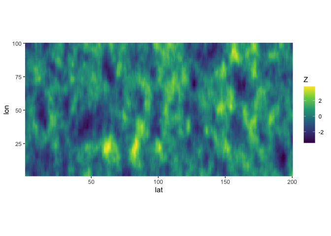
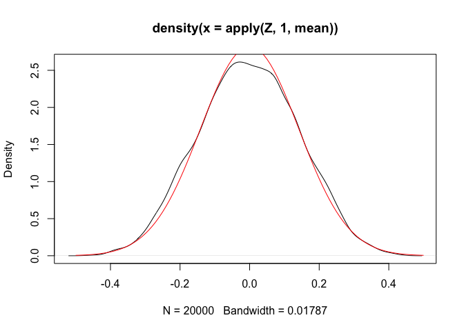
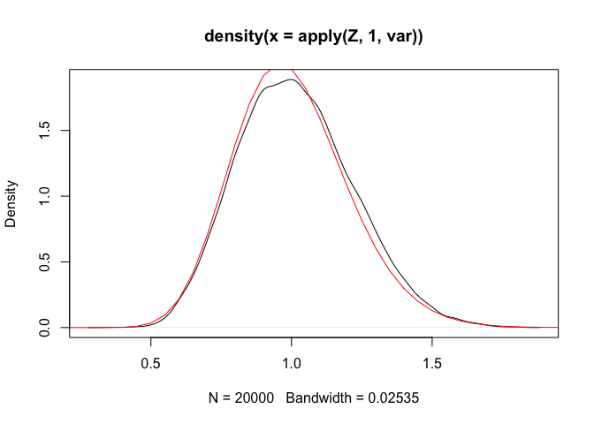

# stdmatern

This directory is for development of fast and memory-efficient code that
creates Matérn precision matrices that have been standardized so that
their inverse is a correlation matrix. The methods used in this code are
described in [a paper I am working
on](https://bggj.is/materneigenpaper/).

The package is still in very active development and should not be
considered a stable product yet. The package can be installed with

``` r
pak::pak("bgautijonsson/stdmatern")
```

``` r
library(stdmatern)
```

    Loading required package: Matrix

# Sampling spatial data

Here we sample 50 replicates of highly dependent spatial data on a
200x100 grid, i.e. there’s 20.000 observational locations.

``` r
start <- tictoc::tic()
dim1 <- 200
dim2 <- 100
rho1 <- 0.6
rho2 <- 0.9
nu <- 2
n_obs <- 50
Z <- rmatern_copula_eigen(n_obs, dim1, dim2, rho1, rho2, nu)
stop <- tictoc::toc()
```

    2.094 sec elapsed

``` r
tibble(
  Z = as.numeric(Z[, 1])
) |> 
  mutate(
    lat = rep(seq_len(dim1), each = dim2),
    lon = rep(seq_len(dim2), times = dim1),
  ) |> 
  ggplot(aes(lat, lon, fill = Z)) +
  geom_raster() +
  scale_fill_viridis_c() +
  coord_fixed(expand = FALSE)
```



``` r
stop$callback_msg
```

    [1] "2.094 sec elapsed"

On the plots below, the distribution of sample statistics are shown in
black while the theoretical distributions of standard normal variables
is shown in red.

``` r
Z  |> apply(1, mean) |> density() |> plot()
curve(dnorm(x, 0, 1 / sqrt(n_obs)), add = TRUE, from = -0.5, to = 0.5, col = "red")
```



``` r
apply(Z, 1, var) |> density() |> plot()
curve((n_obs - 1) * dchisq((n_obs - 1) * x, df = (n_obs - 1)), col = "red", from = 0, to = 5, add = TRUE)
```



# Normal density

The package implements a method for calculating the log-density of a
multivariate normal with appropriate precision matrix, defined as

$$
\mathbf{Q} = \left( \mathbf{Q}_{\rho_1} \otimes \mathbf{I_{n_2}} + \mathbf{I_{n_1}} \otimes \mathbf{Q}_{\rho_2} \right)^{\nu + 1}, \quad \nu \in \{0, 1, 2\},
$$

where $\nu$ is a smoothness parameter, $\otimes$ is the Kronecker
product and each $Q_\rho$ is a precision matrix corresponding to a
one-dimensional AR(1) process with unit marginal variance.

To evaluate the density of the random sample generated above we would
run:

``` r
tictoc::tic()
dens <- dmatern_copula_eigen(Z, dim1, dim2, rho1, rho2, nu) |> sum()
tictoc::toc()
```

    0.62 sec elapsed

## Folded Circulant Approximation

The package also provides a circulant approximation to the precision
matrix, $\mathbf Q$, with reflective boundary conditions. This lets us
do fast computations because of the FFT. This package uses the [FFTW C
library](https://www.fftw.org/) for FFT computations, and the [Eigen C++
library](https://eigen.tuxfamily.org/index.php?title=Main_Page) for more
general computations.

``` r
tictoc::tic()
dens <- dmatern_copula_folded(Z, dim1, dim2, rho1, rho2, nu) |> sum()
tictoc::toc()
```

    0.071 sec elapsed

# Benchmarks

The following section contains a simple benchmark to compare the
computation times of the exact method and the folded approximation. For
further benchmarks, see the working paper linked above.

``` r
my_fun <- function(dim) {
  X <- rmatern_copula_eigen(1, dim, dim, rho, rho, nu)
  bench::mark(
    "Eigen" = dmatern_copula_eigen(X, dim, dim, rho, rho, nu),
    "Folded" = dmatern_copula_folded(X, dim, dim, rho, rho, nu),
    filter_gc = FALSE,
    iterations = 20,
    check = FALSE
  ) |>
    mutate(
      dim = dim
    )
}
```

``` r
rho <- 0.5
nu <- 2
results <- purrr::map(
  c(seq(20, 240, by = 20)),
  my_fun
) |> purrr::list_rbind()
```

``` r
results |> 
  mutate(
    dim = glue::glue("{dim}x{dim}"),
    expression = as.character(expression)
  )  |> 
  select(
    Grid = dim, expression, median
  ) |> 
  tidyr::pivot_wider(names_from = expression, values_from = median)
```

    # A tibble: 12 × 3
       Grid    dmatern_copula_eigen(X, dim, dim, rho, rho, …¹ dmatern_copula_folde…²
       <glue>  <bench_tm>                                     <bench_tm>            
     1 20x20   0.000244565                                    0.0001152511          
     2 40x40   0.001670340                                    0.0002810345          
     3 60x60   0.007151035                                    0.0005678089          
     4 80x80   0.022252832                                    0.0011894921          
     5 100x100 0.051037436                                    0.0016876420          
     6 120x120 0.088788534                                    0.0025653904          
     7 140x140 0.156584720                                    0.0038019300          
     8 160x160 0.297652354                                    0.0054231521          
     9 180x180 0.418930067                                    0.0070010575          
    10 200x200 0.596900140                                    0.0077483030          
    11 220x220 0.892151616                                    0.0136930775          
    12 240x240 1.358173770                                    0.0148482526          
    # ℹ abbreviated names: ¹​`dmatern_copula_eigen(X, dim, dim, rho, rho, nu)`,
    #   ²​`dmatern_copula_folded(X, dim, dim, rho, rho, nu)`
