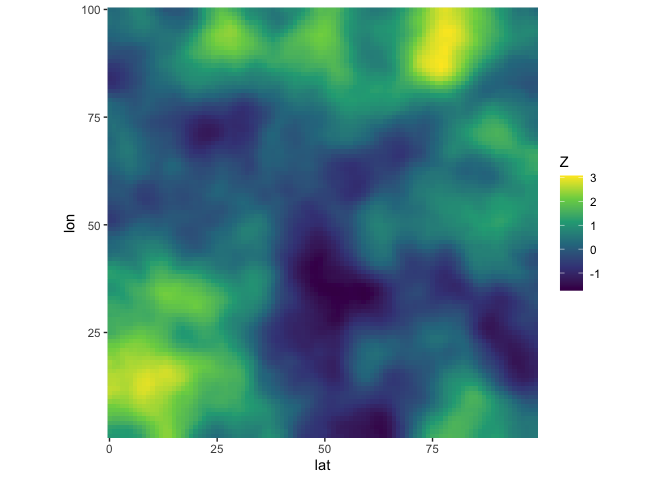

<!-- README.md is generated from README.Rmd. Please edit that file -->

# stdmatern

This directory is for development of fast and memory-efficient code that
creates Matérn precision matrices that have been standardized so that
their inverse is a correlation matrix. The code is written in C++ and
made available inside R with the `{Rcpp}` packages.

The package can be installed with

``` r
pak::pak("bgautijonsson/stdmatern")
```

``` r
library(stdmatern)
#> Loading required package: Matrix
```

``` r
Q <- make_standardized_matern(dim = 3, rho = 0.5, nu = 0)
```

``` r
Q
#> 9 x 9 sparse Matrix of class "dgCMatrix"
#>                                                                                
#>  [1,]  1.155093 -0.2808520  .        -0.2808520  .          .          .       
#>  [2,] -0.280852  1.2291667 -0.280852  .         -0.2661131  .          .       
#>  [3,]  .        -0.2808520  1.155093  .          .         -0.2808520  .       
#>  [4,] -0.280852  .          .         1.2291667 -0.2661131  .         -0.280852
#>  [5,]  .        -0.2661131  .        -0.2661131  1.2962963 -0.2661131  .       
#>  [6,]  .         .         -0.280852  .         -0.2661131  1.2291667  .       
#>  [7,]  .         .          .        -0.2808520  .          .          1.155093
#>  [8,]  .         .          .         .         -0.2661131  .         -0.280852
#>  [9,]  .         .          .         .          .         -0.2808520  .       
#>                           
#>  [1,]  .          .       
#>  [2,]  .          .       
#>  [3,]  .          .       
#>  [4,]  .          .       
#>  [5,] -0.2661131  .       
#>  [6,]  .         -0.280852
#>  [7,] -0.2808520  .       
#>  [8,]  1.2291667 -0.280852
#>  [9,] -0.2808520  1.155093
```

``` r
Q |> solve()
#> 9 x 9 sparse Matrix of class "dgCMatrix"
#>                                                                       
#>  [1,] 1.00000000 0.27611088 0.08016032 0.27611088 0.1353601 0.05357375
#>  [2,] 0.27611088 1.00000000 0.27611088 0.13559322 0.2783556 0.13559322
#>  [3,] 0.08016032 0.27611088 1.00000000 0.05357375 0.1353601 0.27611088
#>  [4,] 0.27611088 0.13559322 0.05357375 1.00000000 0.2783556 0.08474576
#>  [5,] 0.13536011 0.27835560 0.13536011 0.27835560 1.0000000 0.27835560
#>  [6,] 0.05357375 0.13559322 0.27611088 0.08474576 0.2783556 1.00000000
#>  [7,] 0.08016032 0.05357375 0.02605210 0.27611088 0.1353601 0.05357375
#>  [8,] 0.05357375 0.08474576 0.05357375 0.13559322 0.2783556 0.13559322
#>  [9,] 0.02605210 0.05357375 0.08016032 0.05357375 0.1353601 0.27611088
#>                                       
#>  [1,] 0.08016032 0.05357375 0.02605210
#>  [2,] 0.05357375 0.08474576 0.05357375
#>  [3,] 0.02605210 0.05357375 0.08016032
#>  [4,] 0.27611088 0.13559322 0.05357375
#>  [5,] 0.13536011 0.27835560 0.13536011
#>  [6,] 0.05357375 0.13559322 0.27611088
#>  [7,] 1.00000000 0.27611088 0.08016032
#>  [8,] 0.27611088 1.00000000 0.27611088
#>  [9,] 0.08016032 0.27611088 1.00000000
```

Creating and standardizing a 1600x1600 precision matrix

``` r
bench::mark(
  make_standardized_matern(dim = 40, rho = 0.5, nu = 0)
)
#> # A tibble: 1 × 6
#>   expression                             min median `itr/sec` mem_alloc `gc/sec`
#>   <bch:expr>                           <bch> <bch:>     <dbl> <bch:byt>    <dbl>
#> 1 make_standardized_matern(dim = 40, … 1.3ms 1.32ms      755.    98.3KB        0
```

# Sampling spatial data

Here we sample highly dependent spatial data on a 100x100 grid,
i.e. there’s 10.000 observational locations.

``` r
start <- tictoc::tic()
grid_dim <- 100
rho <- 0.9
nu <- 2
Z <- sample_standardized_matern(grid_dim, rho, nu, 1)

tibble(
  Z = as.numeric(Z)
) |> 
  mutate(
    id = row_number(),
    lat = (id - 1) %% grid_dim,
    lon = cumsum(lat == 0),
  ) |> 
  ggplot(aes(lat, lon, fill = Z)) +
  geom_raster() +
  scale_fill_viridis_c() +
  coord_fixed(expand = FALSE)
```



``` r
stop <- tictoc::toc()
#> 0.21 sec elapsed
```

# Normal density

The package also implements a method for calculating the log-density of
a multivariate normal with appropriate precision matrix. The function
avoids creating the precision matrix Q by using known results about
kroncker sums and eigendecompositions. This causes the density
evaluation to be blazingly fast, even for very large spatial fields.

``` r
library(purrr)
library(glue)
my_fun <- function(dim) {
  x <- sample_standardized_matern(dim, 0.5, 0, 1)
  bench::mark(
    matern_mvn_density(x, dim, 0.5, 0),
    filter_gc = FALSE,
    iterations = 10,
    check = FALSE
  ) |> 
    mutate(
      dim = dim
    )
}

results <- map(c(10, 20, 30, 40, 50, 60, 70, 80, 90, 100, 200), my_fun)

results |> 
  list_rbind() |> 
  select(Q_size = dim,time = median, memory = mem_alloc) |> 
  mutate(
    Field_size = glue("{Q_size^2} locations"),
    Q_size = glue("{Q_size^2}x{Q_size^2}")
  ) |> 
  select(Field_size, Q_size, time)
#> # A tibble: 11 × 2
#>    Field_size      Q_size     
#>    <glue>          <glue>     
#>  1 100 locations   100x100    
#>  2 400 locations   400x400    
#>  3 900 locations   900x900    
#>  4 1600 locations  1600x1600  
#>  5 2500 locations  2500x2500  
#>  6 3600 locations  3600x3600  
#>  7 4900 locations  4900x4900  
#>  8 6400 locations  6400x6400  
#>  9 8100 locations  8100x8100  
#> 10 10000 locations 10000x10000
#> 11 40000 locations 40000x40000
```
